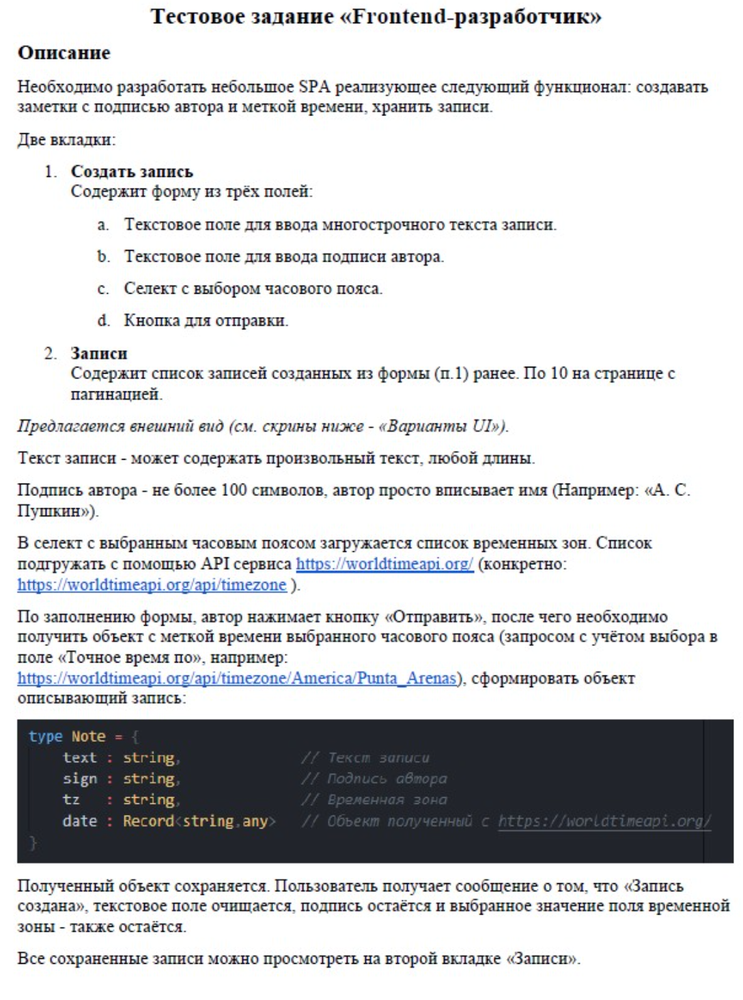
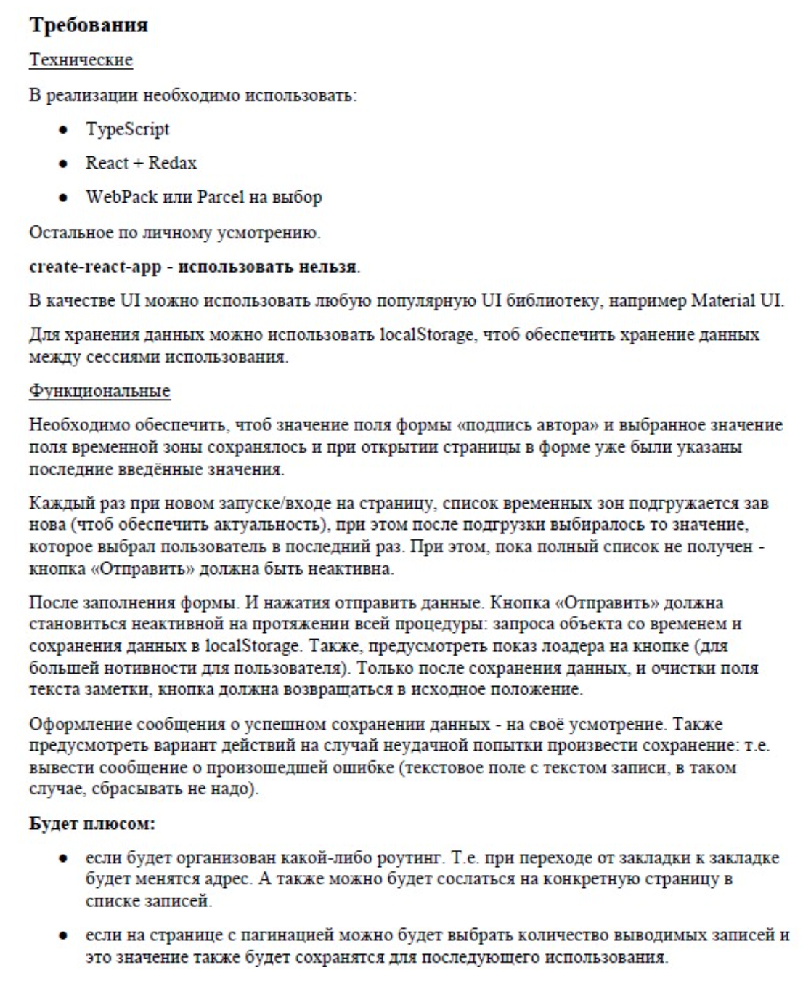
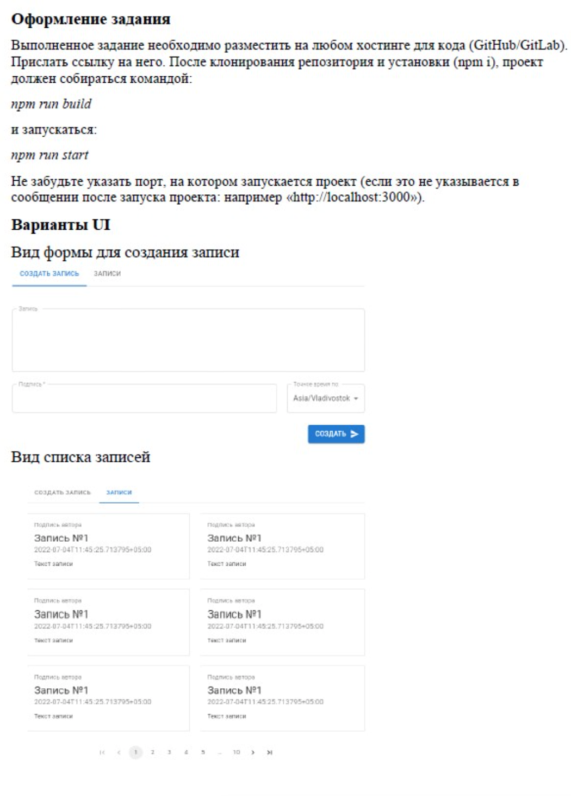

# Test task for the position of middle / middle + developer

## Details:
- I don't know how to configure webpack. Implemented via CRA
- Implemented without TypeScript

## Task Description:

<b>Show screenshots</b>

## Stack:

## Deploy
Website link: [Test task for the position of middle / middle](https://test-task-middle.vercel.app/)
